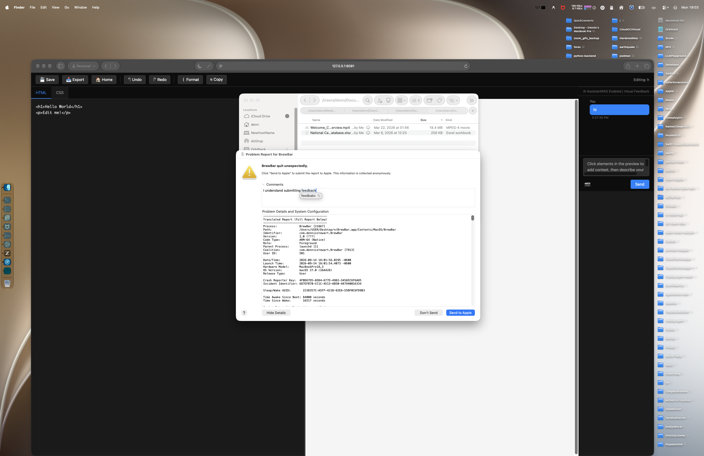

# BrewBar

BrewBar is the ultimate macOS-native GUI for Homebrew, bringing the power of the terminal into a beautiful, spatial, and hyper-integrated graphical experience. Built with pure Swift 6 and SwiftUI, BrewBar looks and feels exactly like an app that Apple built themselves.

## Features & Improvements

BrewBar bridges the gap between CLI power-users and Mac aesthetics with incredible features:

1. **Native Spatial Design:** Implements macOS 27 Liquid Glass and Apple HIG 2026 specs. Unclipped scroll edges, dynamic SF Symbols, and scale-effect spatial hovering on package cards.
2. **Deep Spotlight Integration:** CoreSpotlight securely indexes your locally installed formulas so you can find and launch them instantly from your Mac's native Cmd+Space search bar. Deep-linking seamlessly opens BrewBar straight to the package details.
3. **SwiftData History Manager:** Every single `brew install`, `upgrade`, or `uninstall` is permanently tracked via an ultra-fast, local-first SwiftData `@Model`. View timeline history and expand entries to read exactly what happened in the terminal.
4. **Rich Metadata & Terminal Fallbacks:** Fetches rich GitHub Publisher details and "Last Updated" dates instantly. Includes a built-in terminal parser that extracts the `man` or `--help` pages of any package directly into a native scroll view!
5. **Debounced Semantic Search:** Typing into the search bar intelligently debounces requests (300ms) to ensure lightning-fast UI responsiveness without aggressively triggering the Homebrew API.
6. **Smart Menu Bar Resiliency:** A native Menu Bar drop-down lets you check for updates, upgrade all packages, or quickly bring the main window into focus from anywhere.
7. **Maintenance at a Click:** Safely run `brew doctor` or preview and execute `brew cleanup` from a dedicated Preferences pane to free up gigabytes of cached space.

## Privacy & Security (Zero Telemetry)
BrewBar is designed for maximum security and privacy. 
* **100% Local Execution:** BrewBar acts strictly as a GUI proxy for your local `brew` binary. It does not phone home, nor does it track your installs.
* **No Telemetry:** We explicitly provide an "Opt-out of Homebrew Analytics" button that triggers `brew analytics off` to completely lock down your installation.
* **Secure Enclave Keychain:** GitHub tokens (used *only* to increase API rate limits for fetching Stargazers and Publishers) are encrypted and stored directly in the Apple Keychain. 
* **Safe Subprocesses:** Under the hood, BrewBar runs sandboxed `Process` executions securely routing arguments, making it completely immune to malicious shell injections.

## Copyright
All `.swift` source code files are copyright protected.
// Copyright © 2026 Dennis Stewart. All rights reserved.
